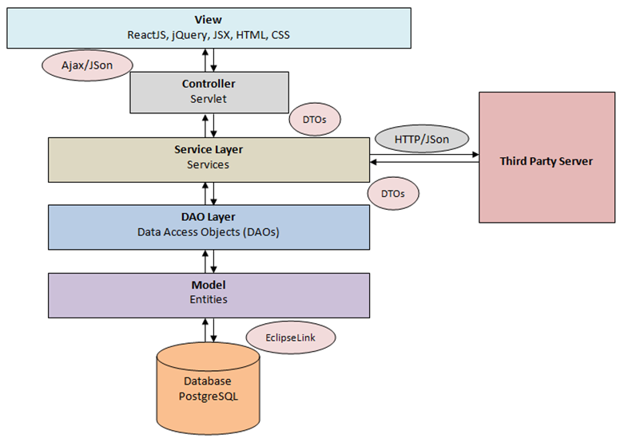

User Data Application
===============================

Problem
-------

There is a back-end server that shares user data with client systems
through HTTP requests in JSON format.

The backend server transmits the following user information to the
backend client via HTTP:

-   ID (exactly once)

-   Name (exactly once)

-   Email (exactly once)

-   Address line 1 (exactly once)

-   Address line 2 (zero or one occurrences )

-   Town/City (exactly once)

-   Postal Code (zero or one occurrences )

-   Country (exactly once)

-   Telephone number (zero to three occurrences)

The back-end client requests the data from the server retrieve the data
from the response and store it to a database.

CRUD functionality is available in the back-end client which allows
creating new user records, updating existing user records and deleting
existing user records.

A web front-end uses these APIs to carryout requesting data from the
third party server, storing the retrieved data in the local database,
and performing the CRUD operations on locally saved data.

Used Tools and Technologies
===========================

1.  JDK 1.8

2.  EclipseLink (JPA 2.1)

3.  NetBeans 8.2

4.  GlassFish Server 5

5.  Maven 3.1

6.  PostgreSQL 9.5

7.  WireMock 1.57

8.  Postman 5.3

9.  ReactJS 16.1, jQuery 3.2, HTML, JSX, CSS

10. Google Gson 2.8

11. Apache HttpClient 4.5

Design
======

Design Decisions
----------------

1.  All of the tools are free for non commercial use.

2.  Used WireMock in standalone mode to substitute a third part server
    which would respond to http requests in JSON format.

3.  Front end was developed in ReactJS, HTML, CSS, jQuery, and JSX

4.  To retrieve data from third party server, name of a person is used.
    This can be replaced by any other unique identification as required.
    Name just denotes the place holder for identifier.

5.  In the client back-end system, the name is used as first name and
    last name. This was done as a provision for future improvements.

6.  Client back-end follows Model-View-Controller (MVC) architecture. To
    maintain a clear segregation between layers, Data Access
    Object (DAO) layer and Business Service layer were not mixed up even
    though some of the business services don’t do much at this moment.
    That way, it was easier to keep the same level of abstraction in the
    methods in the 2 specific layers. Data is transferred between layers
    with using Data Transfer Objects (DTOs).

7.  Singleton pattern was followed where applicable.

8.  Interfaces were used for clear demarcation of responsibilities. This
    may not look hugely advantageous at this stage. But moving forward,
    this could help significantly.

9.  Even though, the code is mostly self explanatory, explicit javadoc
    commenting was carried out for all public and non-public methods
    and classes.

10. For ORAM mapping with persistence, EclipseLink was used.

11. A simple Servlet acts as the front controller. web.xml configuration
    just directs 5 unique url patterns to the Servlet. These are for the
    5 functionalities available in the application (finding in the
    external server, and CRUD operations).

12. Google Gson was used to switch between JSON and Java objects.

13. Apache HttpClient was used to communicate in HTTP with the third
    party back-end server.

Architecture
============

